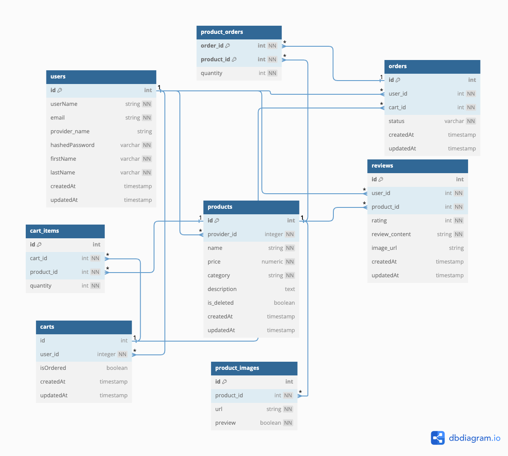

# Shopothalamus

## Live Site

- https://shopothalamus.onrender.com


Shopothalamus, a full-stack application inspired by Amazon, is an e-commerce platform where users can buy and sell a wide range of unique products and items.

## Database Schema Design


<div style="max-width: 600px; margin: auto;">
    
</div>

## Get Started

## Author
 * Nur Unlu
   * https://github.com/NurCodeWiz

**Prerequisites**
- NPM
- A version of Node.js >= 14 on your local machine
- Python 3.9
- PostgreSQL
- An AWS S3 bucket

**Installation**
- Clone the repo
- Install dependencies ``` pipenv install --dev -r dev-requirements.txt && pipenv install -r requirements.txt```
- `cd react-app` and run `npm install`
- Create a **.env** file based on the example with proper settings for your development environment
- Setup a PostgreSQL database, user, and password and make sure they match your **.env** file.
- Get into your pipenv, migrate your database, seed your database, and run your app

   ```bash
   pipenv shell
   ```

   ```bash
   flask db upgrade
   ```

   ```bash
   flask seed all
   ```

   ```bash
   flask run

- Create your AWS user and bucket:
    - Create a bucket: (https://s3.console.aws.amazon.com/s3/home?region=us-east-1)
    - Navigate to ( https://console.aws.amazon.com/iam/home?#/users) to create a user with `Programmatic access`.
    - Set up a security policy for your user: 'Attach existing policies directly' => 'Create Policy'
    - Click the `JSON` tab and set a policy.
- Now update your **.env** with your `S3_BUCKET`, `S3_KEY`, `S3_SECRET`
- Fire up your servers: `flask run` in root and `npm start` in `react-app`

## Technologies
- JavaScript
- React
- Redux
- PostgreSQL
- Python
- AWS SDK

## Features

1. **Landing Page**


--------------------------------------------------------------------------------------------------------
2. **Categories Page**


--------------------------------------------------------------------------------------------------------
3. **Search**

   - Users can search for products name using the Search feature.


--------------------------------------------------------------------------------------------------------


4. **All Products Page**


--------------------------------------------------------------------------------------------------------

5. **Authentication**
   - New account creation, log in, and log out functionalities.
   - Guest/demo login option for trying out the site.
   - Users must be logged in to access orders, wish lists, or create reviews.

--------------------------------------------------------------------------------------------------------

6. **Reviews**
   - CRUD operations for product reviews.
   - Users can create new reviews on items.
   - Users can add an image to their review.
   - All users can read existing reviews on items.
   - Review creators can update and delete their own reviews.

   

   - Update review page

   

--------------------------------------------------------------------------------------------------------

7. **Cart**
   - CRUD operations for the shopping cart.
   - Users can create a cart.
   - Users can view the items in their shopping cart.
   - Users can add, update quantities, and remove products from their carts.
   - Total price will be displayed on the shopping cart page.
   - Items that are in the cart will be cleared from the cart after payment is complete.


8. **Checkout Page**
   - Users can checkout their carts and will be directed to the checkout page.


--------------------------------------------------------------------------------------------------------
9. **Orders**
   - CRD operations for orders.
   - Users can see open and past orders.
   - Users can submit their current cart as an order.
   - Users can cancel open orders.


--------------------------------------------------------------------------------------------------------

10. **Products**
   - CRUD operations for product listings.
   - Users can create new product listings.
   - Users can view existing listings.
   - Creators can add and delete product images for their own listings.
   - Creators can update or delete their own product listings.


